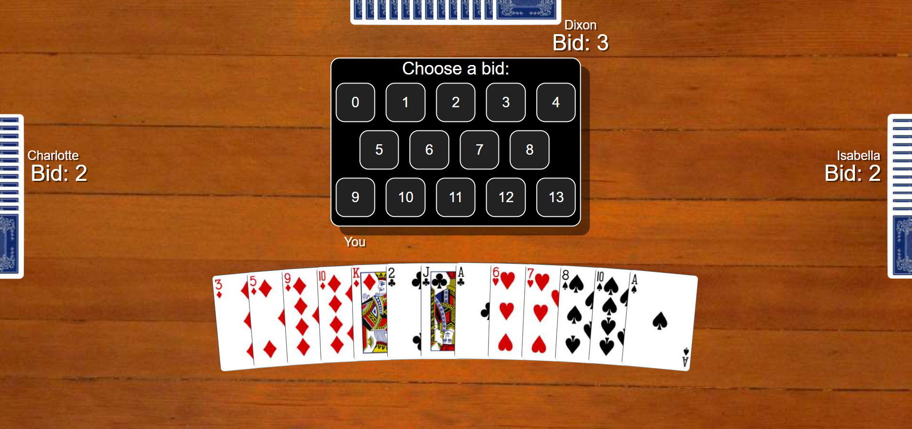

<h1 style="color:navy;text-align:center;">lgo rcade</h1>

<h2>Submission project for <a href="https://www.encode.club/algorand-hack" target="_blank">Encode Club Algorand Hackathon</a> by Maurice Walker</h2>

<h3>&hearts;&nbsp; Introduction &nbsp;&hearts;</h3>

Algo Arcade is your destination for online entertainment that runs on Algorand. Algo Arcade is a collection of games including AlgoSPADES and AlgoHEARTS. These games were built for fellow Algorand enthusiasts by an Algorand enthusiast! Click <a href="https://algoarcade.herokuapp.com" target="_blank">here now</a> and let the games begin!

<h3>&spades;&nbsp; Features &nbsp;&spades;</h3>
<ul>
 <li>User-Friendly Interface</li>
 <li>Realistic gameplay</li>
 <li>Minimal requirements needed</li>
 <li>Eligible for all age groups</li>
</ul>

<h3>&diams;&nbsp; Software Used &nbsp;&diams;</h3>
  <ul>
    <li>HTML</li>
    <li>CSS</li>
    <li>Javascript</li>
    <li>Heroku</li>
  </ul>

<h3>&clubs;&nbsp; Screenshots &nbsp;&clubs;</h3>

